::: {.page-heading}
# People

Everyone currently involved in leading and supervising the ReDiLEEP network, across its beneficiary and associated partner organisations. Doctoral candidates will be added here once recruitment is complete (see [Vacancies](vacancies.qmd)).
:::

::: {.section .people-grid}
::: {.person .person-no-photo}
**Alicia Montesinos**  
Affiliation to be confirmed
:::

::: {.person}
```{=html}
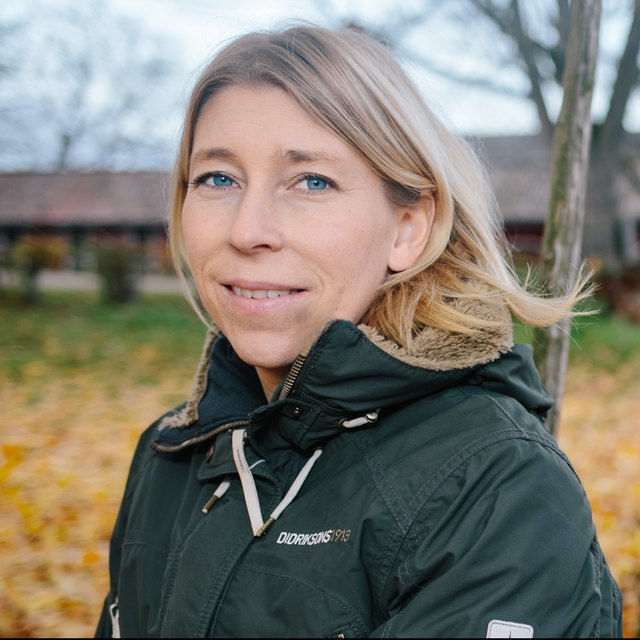
```
**Anna Eklöf**  
Linköping University
:::

::: {.person .person-no-photo}
**Buntarou Kusumoto**  
ThinkNature
:::

::: {.person .person-no-photo}
**Claire Burke**  
Zulu Ecosystems
:::

::: {.person .person-no-photo}
**Cornelia Krug**  
Affiliation to be confirmed
:::

::: {.person .person-no-photo}
**Dan Eastwood**  
Affiliation to be confirmed
:::

::: {.person .person-no-photo}
**Daniel Jones**  
Advanced Invasives
:::

::: {.person}
```{=html}
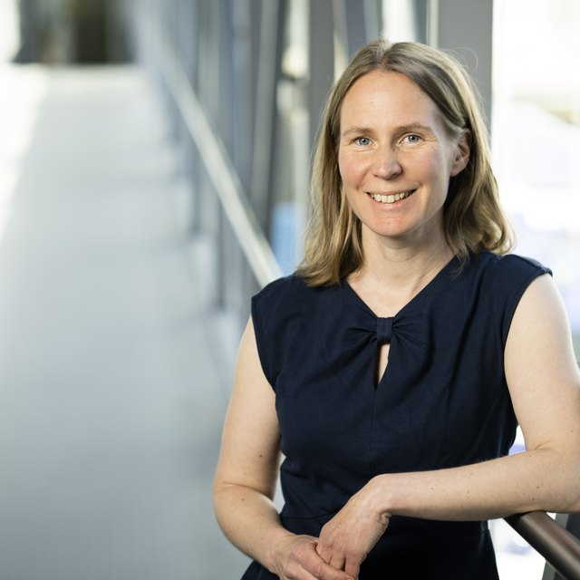
```
**Elina Kaarlejärvi**  
University of Helsinki
:::

::: {.person .person-no-photo}
**Francesco de Bello**  
Agencia Estatal Consejo Superior de Investigaciones Científicas
:::

::: {.person}
```{=html}
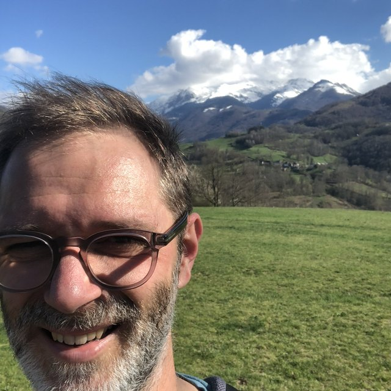
```
**Frederik De Laender**  
University of Namur
:::

::: {.person}
```{=html}
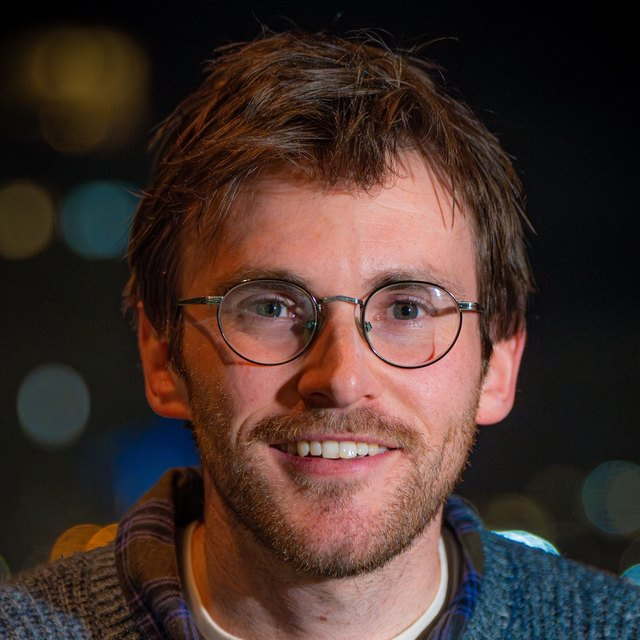
```
**Fredric Windsor**  
Cardiff University
:::

::: {.person}
```{=html}
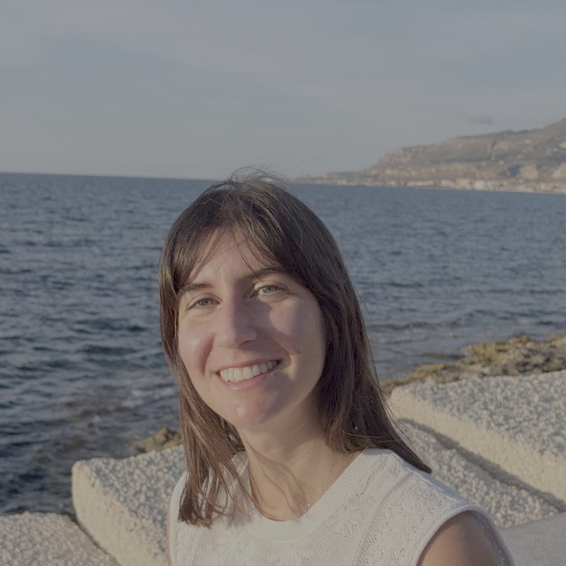
```
**Giulia Ghedini**  
Monash University
:::

::: {.person .person-no-photo}
**Guillermo Casanova**  
Generalitat Valenciana / CIEF
:::

::: {.person .person-no-photo}
**György Barabas**  
Affiliation to be confirmed
:::

::: {.person}
```{=html}
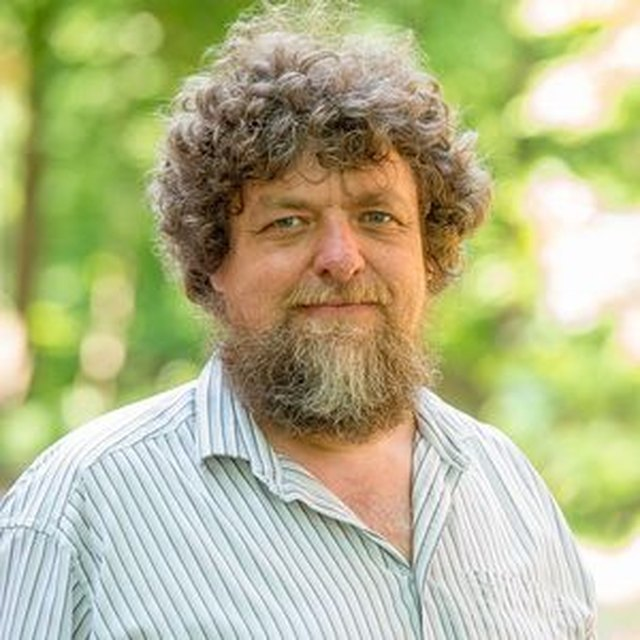
```
**Helmut Hillebrand**  
University of Oldenburg
:::

::: {.person .person-no-photo}
**Ian Donohue**  
Trinity College Dublin
:::

::: {.person .person-no-photo}
**Kathryn Mullins**  
Welsh Government
:::

::: {.person .person-no-photo}
**Laura Antão**  
Affiliation to be confirmed
:::

::: {.person}
```{=html}
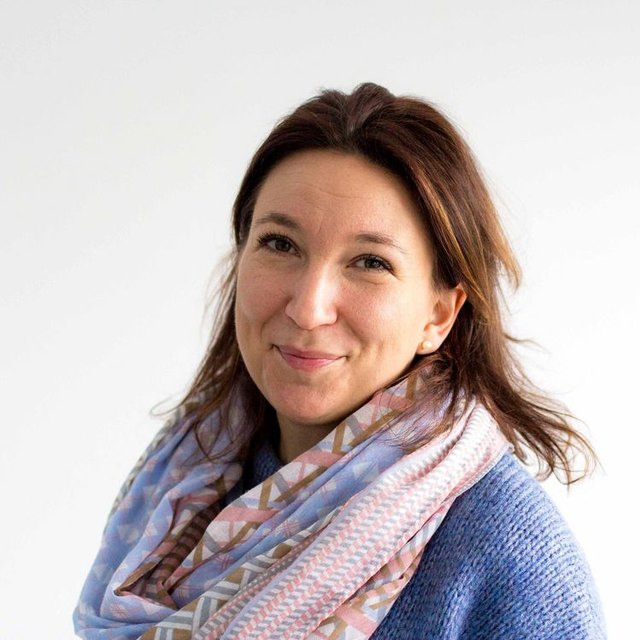
```
**Maren Striebel**  
Affiliation to be confirmed
:::

::: {.person}
```{=html}
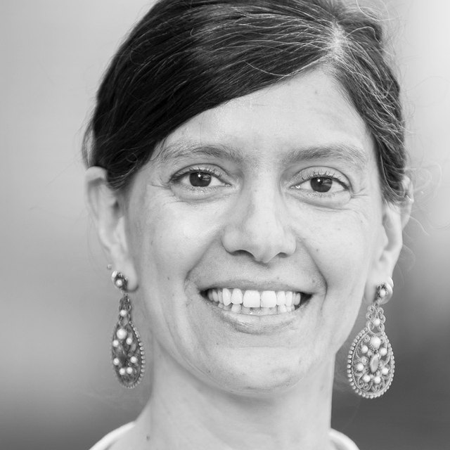
```
**Maria Santos**  
University of Zurich
:::

::: {.person}
```{=html}
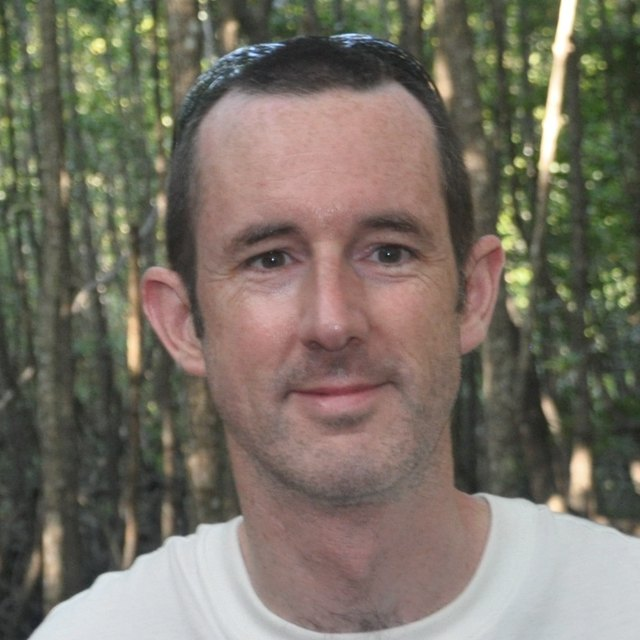
```
**Mike Fowler**  
Swansea University
:::

::: {.person}
```{=html}
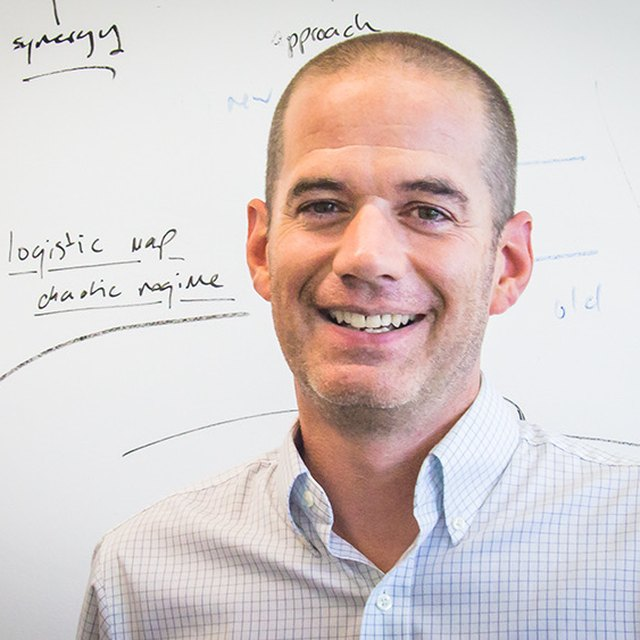
```
**Owen Petchey**  
University of Zurich
:::

::: {.person}
```{=html}
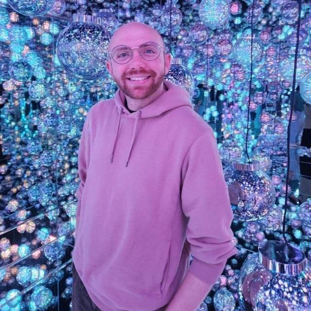
```
**Samuel Ross**  
Okinawa Institute of Science and Technology Graduate University
:::

::: {.person .person-no-photo}
**Sara Keen**  
Earth Species Project
:::

::: {.person .person-no-photo}
**Tad Dallas**  
Affiliation to be confirmed
:::

::: {.person .person-no-photo}
**Thomas Lyrholm**  
Swedish Environmental Protection Agency
:::

::: {.person .person-no-photo}
**Ute Jacob**  
Affiliation to be confirmed
:::

:::
