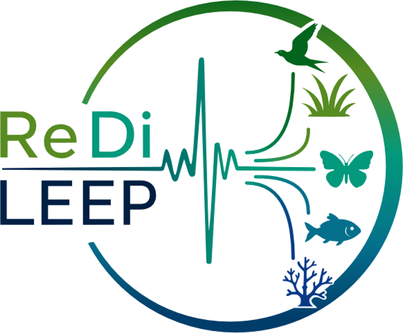

::: {.page-heading}
# {.title-mark alt=""} Vacancies

ReDiLEEP will recruit 13 doctoral candidates into linked response diversity projects.
:::

::: {.section .text-list}
## Recruitment of Doctoral Candidates

Recruitment of doctoral candidates will take place during the second half of 2026. General recruitment information, including general eligibility and employment conditions are here:

[Read the general recruitment information](news/recruitment-information.qmd)
:::

::: {.section .text-list}
## Planned Doctoral Projects

**DC1, LiU:** How structural patterns of species interactions affect response diversity  
Host: LiU; PhD-awarding entity: LiU.  
Main supervisor: Anna Eklöf. Co-supervisor(s): György Barabas.

**DC2, LiU:** Using soundscapes to reveal how species interaction networks shape response diversity  
Host: LiU; PhD-awarding entity: LiU.  
Main supervisor: Anna Eklöf. Co-supervisor(s): Samuel Ross; Sara Keen.

**DC3, UOL:** The effect and fate of response diversity under environmental change  
Host: UOL; PhD-awarding entity: UOL.  
Main supervisor: Helmut Hillebrand. Co-supervisor(s): Maren Striebel.  
[Apply via EURAXESS](https://euraxess.ec.europa.eu/jobs/461332){.btn-inline}

**DC4, CarU:** How can we measure response diversity at scale across taxa?  
Host: CarU; PhD-awarding entity: CarU.  
Main supervisor: Fredric Windsor. Co-supervisor(s): Samuel Ross.

**DC5, CarU:** Do biotic interactions homogenise responses and reduce response diversity?  
Host: CarU; PhD-awarding entity: CarU.  
Main supervisor: Fredric Windsor. Co-supervisor(s): Giulia Ghedini; Tad Dallas.

**DC6, UNamur:** A general theory of response diversity effects on stability and coexistence  
Host: UNamur; PhD-awarding entity: UNamur.  
Main supervisor: Frederik De Laender. Co-supervisor(s): Mike Fowler; Giulia Ghedini.

**DC7, UNamur:** Mean response and response diversity predict impact across environmental contexts  
Host: UNamur; PhD-awarding entity: UNamur.  
Main supervisor: Frederik De Laender. Co-supervisor(s): Owen Petchey.

**DC8, CSIC:** Disruption of compensatory dynamics under extreme climatic events  
Host: CSIC; PhD-awarding entity: Universitat de València.  
Main supervisor: Francesco de Bello. Co-supervisor(s): Alicia Montesinos.

**DC9, UH:** Boreal forest and tundra plant communities under environmental change  
Host: UH; PhD-awarding entity: UH.  
Main supervisor: Elina Kaarlejärvi. Co-supervisor(s): Laura Antão.

**DC10, SwanU:** Restoration of co-invading alien plant species  
Host: SwanU; PhD-awarding entity: SwanU.  
Main supervisor: Mike Fowler. Co-supervisor(s): Dan Eastwood, Dan Jones.

**DC11, UZH:** Integrating response diversity into policy  
Host: UZH; PhD-awarding entity: UZH.  
Main supervisor: Owen Petchey. Co-supervisor(s): Maria Santos; Cornelia Krug; Ute Jacob.

**DC12, UZH:** Opportunities and barriers for response-diversity-enabled policy  
Host: UZH; PhD-awarding entity: UZH.  
Main supervisor: Maria Santos. Co-supervisor(s): Owen Petchey; Cornelia Krug; Ute Jacob.

**DC13, Monash:** Physiological basis and consequences of response diversity  
Host: Monash; PhD-awarding entity: Monash.  
Main supervisor: Giulia Ghedini. Co-supervisor(s): Frederik De Laender; Mike Fowler; Helmut Hillebrand.  
[Apply via EURAXESS](https://euraxess.ec.europa.eu/jobs/460753){.btn-inline}
[View the advertisement on the Ghedini Lab / Monash web page](https://www.giuliaghedini.com/join-us.html)
:::
